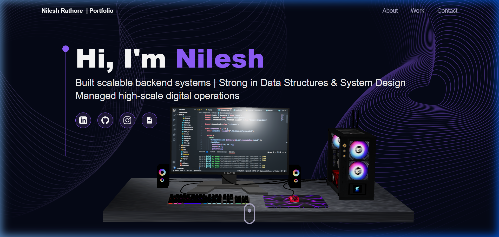

# Nilesh Rathore — Portfolio

A modern, interactive 3D developer portfolio built with **React**, **Three.js**, and **Framer Motion**.



## ✨ Features

- 🖥️ **Animated 3D Desktop PC** — interactive hero model rotates on scroll
- ⭐ **Particle Star Field** — immersive animated background
- 🌍 **Rotating 3D Earth** — in the Contact section
- 🔮 **Floating Skill Balls** — 3D tech icons with hover tilt effects
- 📬 **Live Contact Form** — sends real emails via SMTP (with auto-reply to sender)
- 🎞️ **Smooth Animations** — Framer Motion scroll-reveal effects throughout
- 📱 **Fully Responsive** — adapts to all screen sizes

## 🛠️ Tech Stack

| Layer | Technology |
|-------|-----------|
| Framework | React 19 + Vite |
| Styling | Tailwind CSS v3 |
| 3D Rendering | Three.js, @react-three/fiber, @react-three/drei |
| Animations | Framer Motion |
| 3D Tilt | react-tilt |
| Backend | Node.js + Express |
| Email | Nodemailer (Gmail SMTP) |
| Routing | React Router DOM |

## 🚀 Getting Started

### Prerequisites
- Node.js v18+
- A Gmail account with [App Password](https://myaccount.google.com/apppasswords) enabled

### 1. Clone the repo
```bash
git clone https://github.com/nileshrathore22/portfolio.git
cd portfolio
```

### 2. Install dependencies
```bash
npm install --legacy-peer-deps
```

### 3. Create environment file
```bash
cp .env.example .env
```
Then edit `.env` and add your Gmail credentials:
```env
EMAIL_USER=your_gmail@gmail.com
EMAIL_PASS=your_google_app_password
```

### 4. Start development servers
```bash
npm run dev
```
This starts both the **Vite frontend** (`http://localhost:5173`) and **Express backend** (`http://localhost:5000`) simultaneously.

## 📁 Project Structure

```
├── public/
│   ├── desktop_pc/       # 3D PC model assets (.gltf)
│   └── planet/           # 3D Earth model assets (.gltf)
├── src/
│   ├── assets/           # Images, icons, tech logos
│   ├── components/       # All React components
│   │   └── canvas/       # Three.js 3D components
│   ├── constants/        # Site data (experience, projects, tech)
│   ├── hoc/              # Higher-order components
│   └── utils/            # Motion variants
├── server.js             # Express SMTP backend
├── .env.example          # Environment variable template
└── vite.config.js
```

## 📧 Contact Form Setup

The form sends:
1. A **notification email** to you (host) with sender details and a "Reply Now" button
2. A **beautiful auto-reply** to the visitor confirming their message was received

## 📄 License

MIT — feel free to fork and customize!

---

Made with ❤️ by **Nilesh Rathore**
